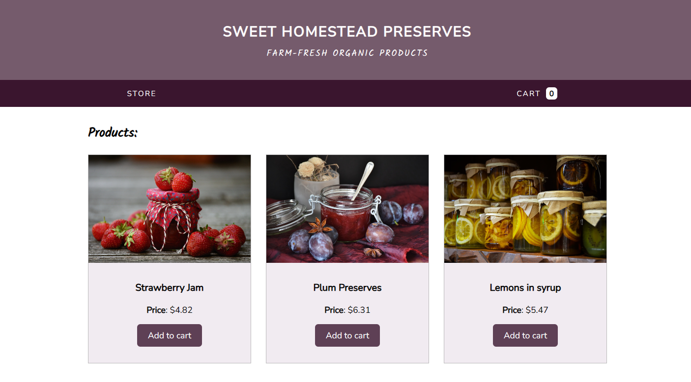

# Sweet Homestead Preserves
## *Online Store Demo Project*

Sweet Homestead Preserves is a simulated web application for an online store where users can explore organic products, add items to their cart, and complete an order. This project serves as a demonstration of frontend development skills, JavaScript functionality, and showcasing the ability to create an engaging and user-friendly shopping experience.




## *Project Overview*

- **Product Catalog:** Explore a variety of organic products and add them to the cart.
- **Shopping Cart:** Seamlessly manage your selections, change the quantity, or remove items on the fly.
- **Order Process:** Complete orders with a straightforward and interactive form with real-time validation for error-free submissions.
- **Responsive Design:**  Enjoy a consistent and visually appealing experience across different devices.

## *Technologies Utilized*

- **Frontend:** HTML, CSS (Flexbox, Media Queries), JavaScript.
- **Data Persistence:** LocalStorage for maintaining cart data.

## *Usage*

### *Exploring the Product Catalog*

Browse through the variety of products and click the "Add to Cart" button to add items to your cart (`index.html`).

### *Managing the Shopping Cart*

Navigate to the "Cart" section (`cart.html`) by clicking on the link in the navigation bar. In the cart, you can:

- Adjust the quantity of each product.
- Apply a 10% discount using the "Apply discount" checkbox.


### *Completing an Order*

Proceed to checkout by clicking the "Proceed" button in the cart. Fill in the required information in the order summary form (`order-summary.html`). Ensure that the entered information is valid as the form performs real-time validation.


### *Order Confirmation*

After completing the order, you will be redirected to the order confirmation page (`order-accepted.html`), where you'll receive a confirmation message. Please note that for the purpose of this demonstration, a simulated server communication delay has been implemented. During the process, you'll see a "Sending..." message to mimic the communication with a server.


## *Structure*

- **`src/css`:** Contains stylesheets for the application.
- **`src/img`:** Holds images used throughout the project.
- **`src/js`:** JavaScript files handling application logic.
  - `home.js`: Logic for the main page (`index.html`) responsible for exploring the product catalog.
  - `cart.js`: Logic for the shopping cart management page (`cart.html`).
  - `order.js`: Logic for the order summary form page (`order-summary.html`).
  - `helpers/createCart.js`: Helper function for handling the navigation bar shopping cart and updating its state based on user interactions.
- **`src/pages/`:** HTML files for different sections of the application.
  - `index.html`: Main page for exploring the product catalog.
  - `cart.html`: Shopping cart management page.
  - `order-summary.html`: Order summary form page.
  - `order-accepted.html`: Order confirmation page.

## How to Run

1. Clone the repository:

   ```bash
   git clone https://github.com/annadada/sweet-homestead-preserves-online-store.git
    ```

2. Open the project folder:
    cd sweet-homestead-preserves-store

3. Open the index.html file in your preferred web browser.

### Disclaimer
This project is a fictional online store created solely for the purpose of showcasing programming skills. It does not represent a fully functional e-commerce platform, and the product descriptions are intentionally omitted for demonstration purposes.